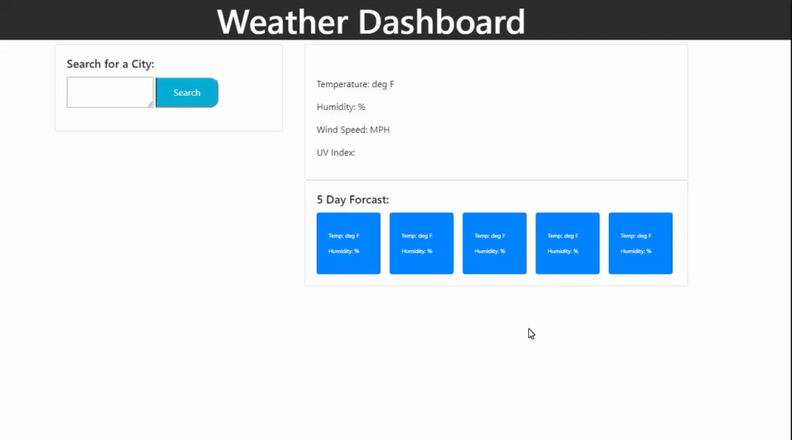

# CONTENTS OF THIS FILE
---------------------

## Introduction

 This repo contains the html, CSS, and JavaScript code for weather information gathering web-application. The application allows the user
 to search any city and immediately get information about the temperature, wind speed, humidity, and UV index of that city at the time it
 was searched. The application also always the user to see the temperature and humidity forecast of that city over the next 5 days. 
 The UV index number is color coded according to its risk factor for human exposure. Further explainations on what level of danger each
 color represents can be found here: https://19january2017snapshot.epa.gov/sunsafety/uv-index-scale-1_.html. After searching for the weather
 of a given city, the application will automatically save a button for you with the name of that city underneat the search bar. If you ever
 wish to check the weather of that city again, you can simply click the button with the name of your desired city.

## Requirements

 In order to run the application for yourself, navigate to the interactive webpage found here: https://sbarrow825.github.io/06-Server-Side-APIs-Weather-Dashboard/
 If you wish to clear the buttons that automatically save for your underneath the search bar, right click anywhere on the page > inspect > application > clear storage
 The application also requires internet connection as it pull information from third party APIs, namely from openweathermap.org.

The following gif demonstrates the application's functionality:

